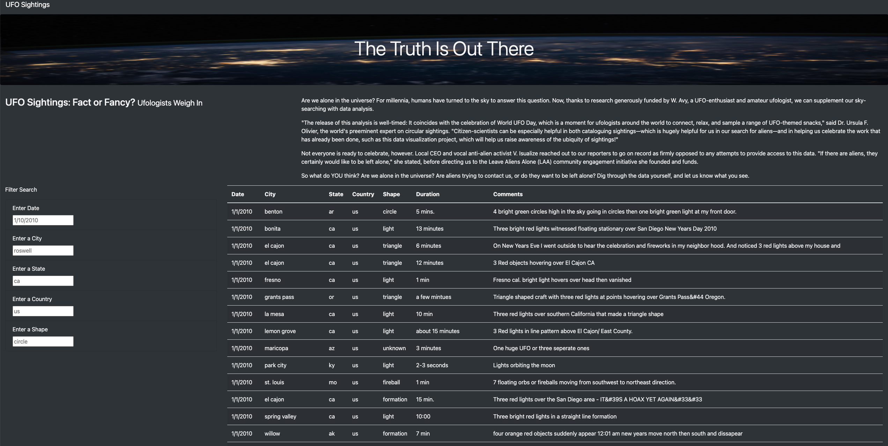
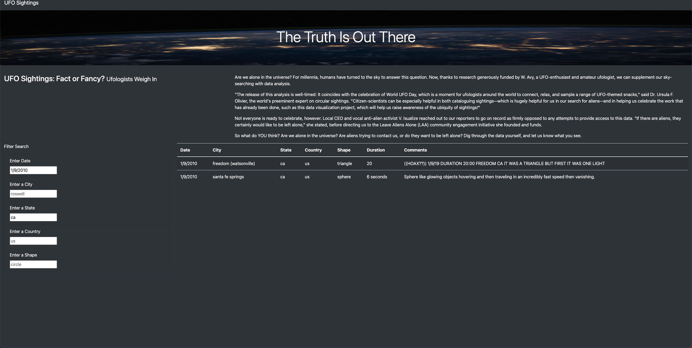

# UFOs
## Overview
In this project, we built a dynamic webpage UFO Finder by inserting JavaScript into an HTML page and using the Bootstrap framework, displayed UFO sightings, created a table to show UFO sightings data, and built several fully functional filters that allowed users to refine their search on more than one level.

## Results
The following was the screenshot of our HTML page.

The webpage contained the article paragraph, the table of UFO Sightings data, and the filters for the table. There were five filters under Filter Search. By entering different search criteria such as Date, City, State, Country, and Shape, our table was updated automatically. 

The following was the screenshot by entering two filers, Date and State.

## Summary
Our dynamic webpage UFO Finder allowed users to filter the data on multiple criteria. However, each filter we designed could only accept one search value. This drawback disabled users to enlarge the table data if they wanted to look into a certain time period or more than one City/State/Country/Shape.

One potential future development was to enable filter data with a given range. For example, the date filter could let users choose an available time period other than a single date. The other recommendation was to allow City, State, Country, and Shape filters to accept multiple enters. 

## GitHub.io
https://kun-kz.github.io/UFOs/
